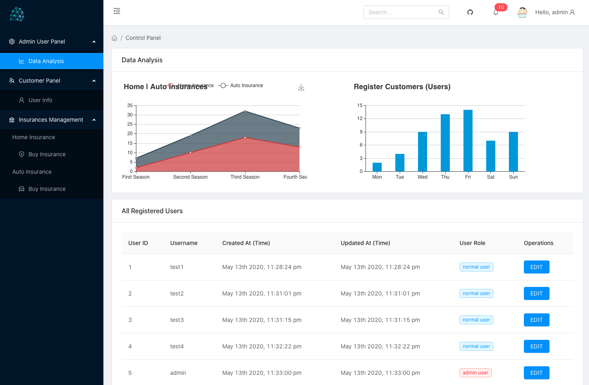
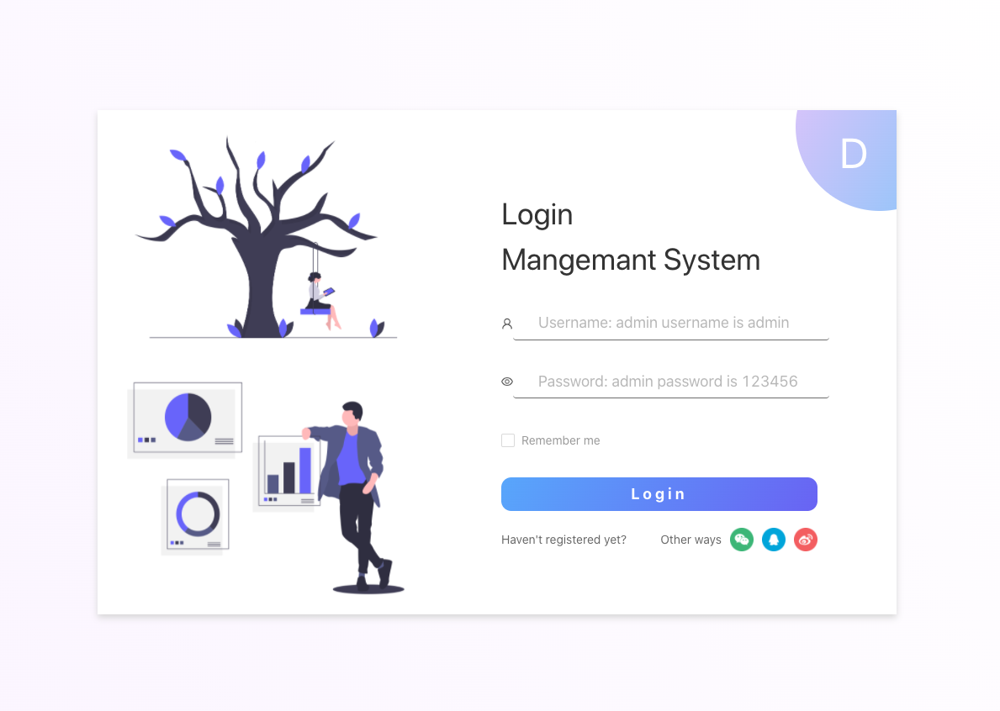
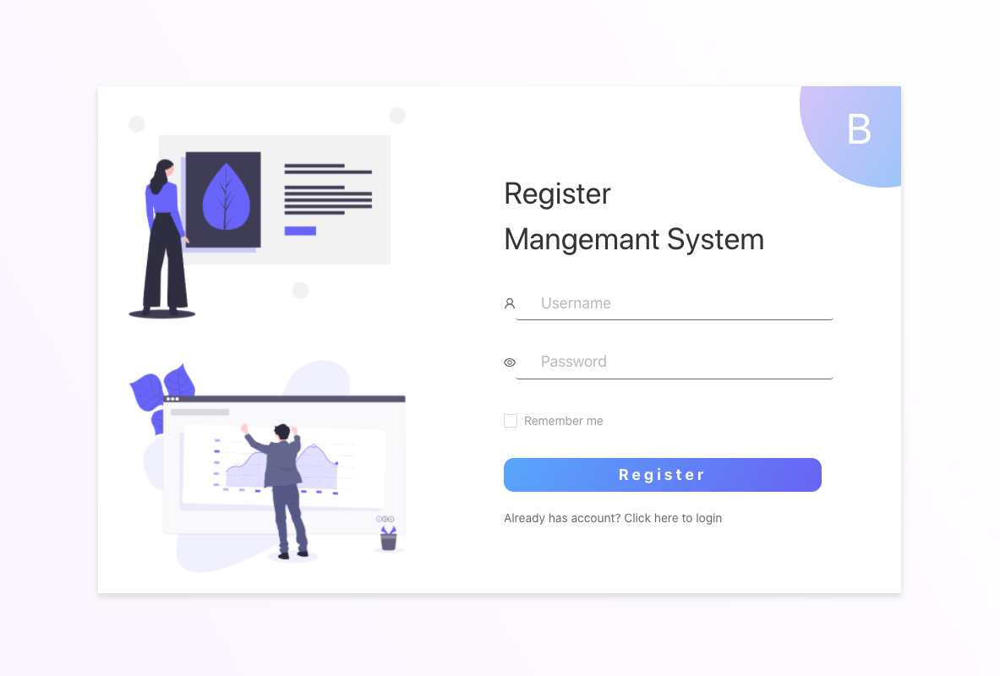
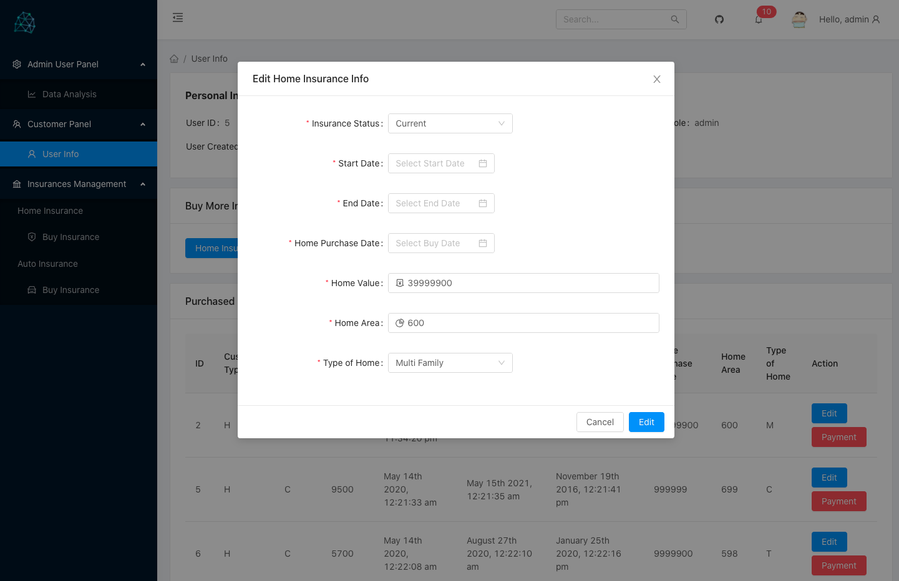
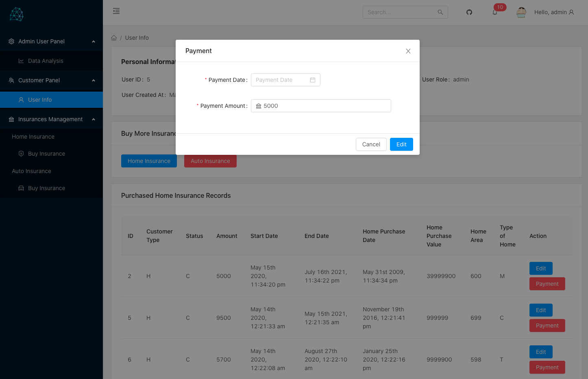
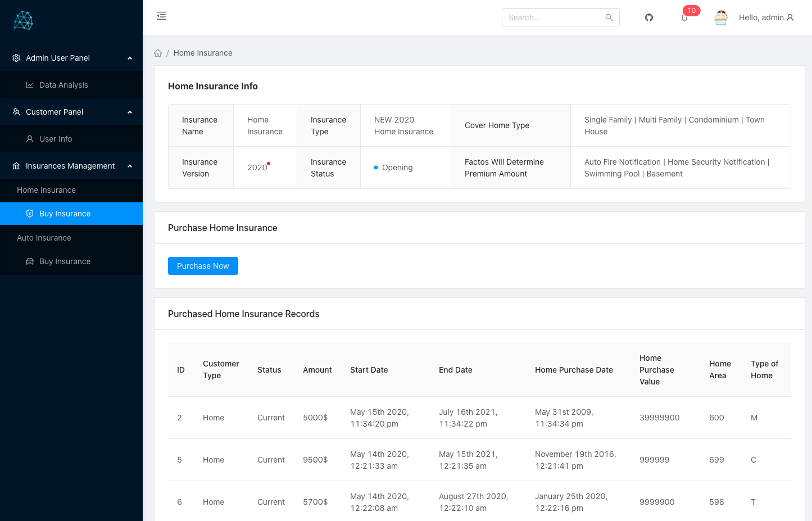
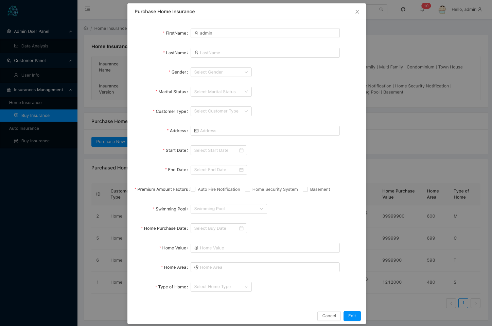
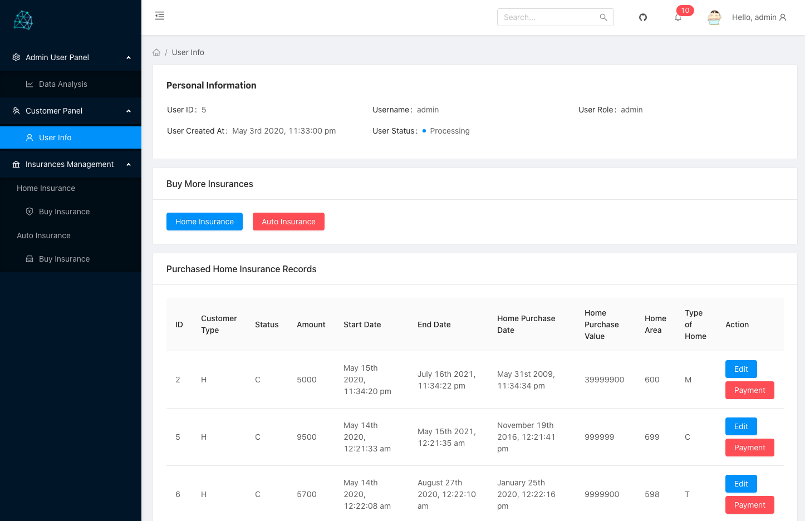
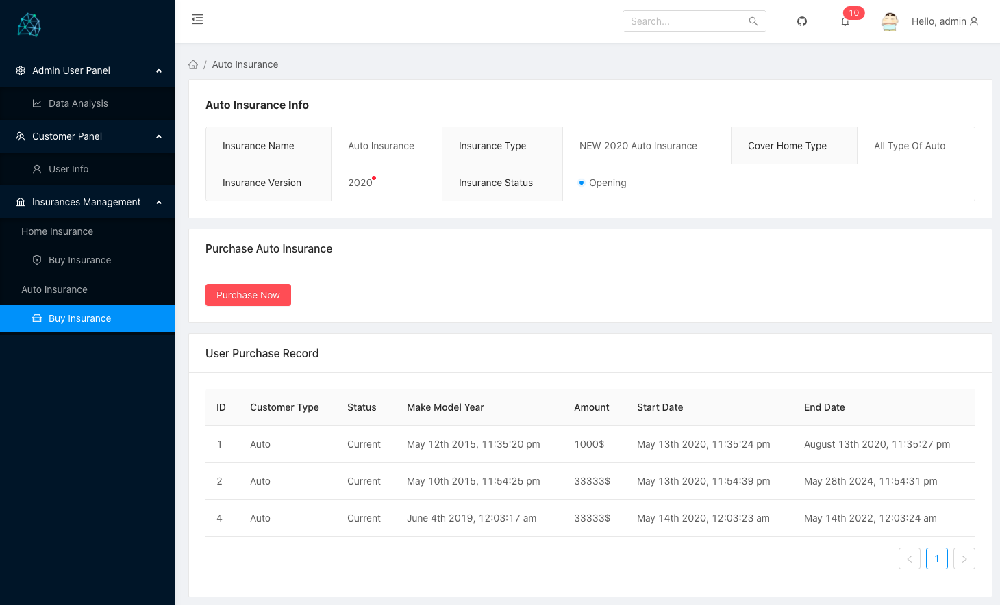
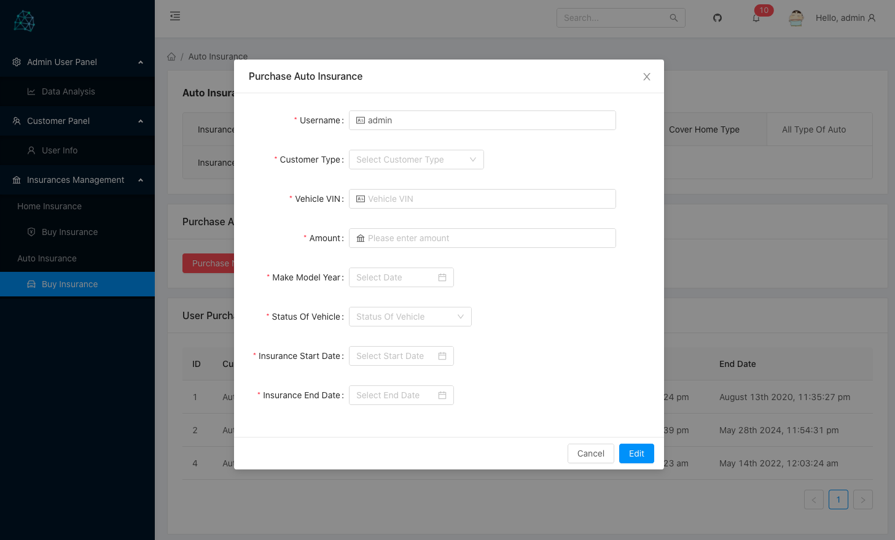

# Insurance Company Official Website

> Insurance Purchase Platform

[Purchase Platform | Deploy on Tencent Shanghai Cloud Server](http://172.81.242.65:3000/#/login) | Website Link | Access a little bit slow

[Insurance Official Website | Deploy on Netlify](https://insurance.chenxii.xyz) | Website Link

### Preview

One | Only Administrator can access this page


Two


Three


Four


Five


Six


Seven


Eight


Nine


Ten


---

### Features

- Login / Register Page
- User password encryption
- Role-based access control
  - Only Administrator can access "Admin User Panel", see all the registered users' information and all users' purchased records, and edit or delete records
  - Customer can only see their information, buy, edit their insurances, and make a payment
- Local cache

---

### Stack | 技术栈

- react
- echarts
- moment
- axios
- sass
- ant design ui
- react-router-dom

---

### Run in local | 本地运行

```
git clone https://github.com/ChenxiiCheng/Management-Platform-Admin.git
cd Management-Platform-Admin
npm install  // Or yarn install
npm run start // Or yarn start
```
